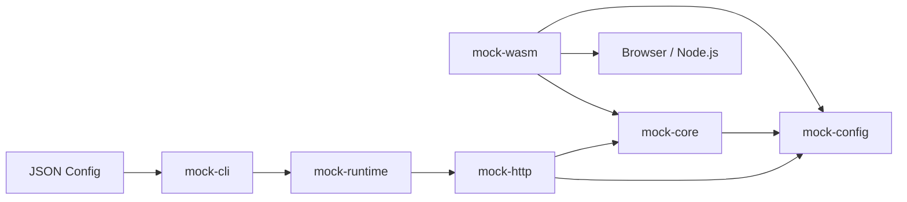
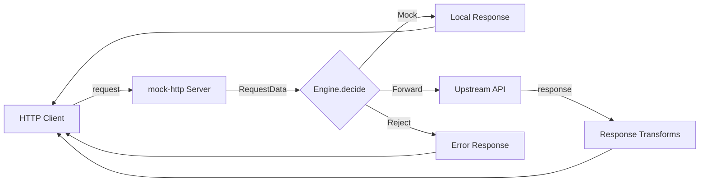
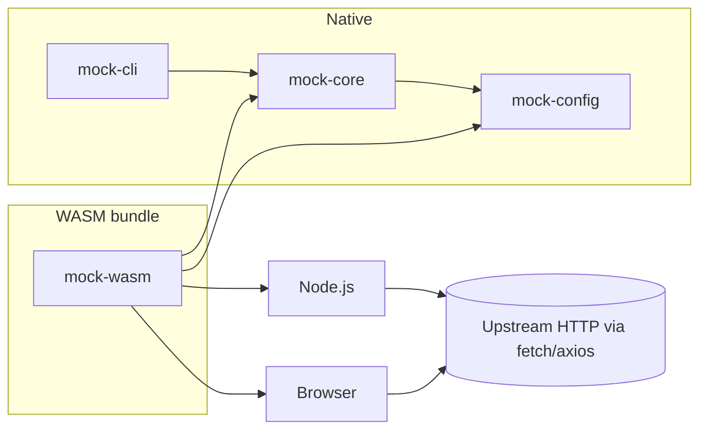

# helpapi

A Rust Mock API CLI tool with WASM export capability.

`helpapi` reads mock rules from a JSON config, runs a local HTTP/HTTPS mock
server, optionally forwards requests to upstream APIs with JSON Pointer
transforms, and exposes a Ratatui terminal UI. The same rule engine is also
published as a WebAssembly package for browser and Node.js reuse.

The CLI binary is named `mock-api`.

---

## Features

- Static mock responses matched by method, path, headers, query, and body
- Upstream forwarding with request/response header, query, status and JSON body transforms
- Path parameters (`:id`) and trailing wildcards (`/static/*`)
- Hot reload of the JSON config (failure-safe: keeps the old config)
- HTTPS support via JKS keystores
- Ratatui TUI for live request inspection
- Reusable WASM engine (`mock-wasm`) for browsers and Node.js

---

## Architecture

The project is a Cargo workspace of six crates with a strict one-way
dependency direction. `mock-core` has zero dependencies on network, terminal,
or WASM layers — it is pure decision logic.



### Request flow



---

## Build

Requires Rust **1.85+** (edition 2024). Optional: `wasm-pack` for building the
WASM package.

```bash
# Build the CLI (release)
cargo build --release

# Run all tests
cargo test --workspace --all-features

# Lint and format checks (the CI gate)
cargo fmt --all --check
cargo clippy --workspace --all-targets --all-features -- -D warnings

# Build the WASM package
wasm-pack build crates/mock-wasm --target bundler
```

The release binary is at `target/release/mock-api`
(`mock-api.exe` on Windows).

---

## Usage

### Start a server

```bash
./target/release/mock-api run --config examples/basic.json
```

Then in another terminal:

```bash
curl -i http://127.0.0.1:8081/posts/1
```

### Other commands

```bash
mock-api validate --config examples/transforms.json
mock-api schema --output mock-api.schema.json
mock-api print-effective-config --config examples/https.json
mock-api version
```

### Run with the interactive TUI

```bash
./target/release/mock-api run --config examples/transforms.json --mode tui
```

TUI keybindings: `q` quit, `r` reload, `c` clear history, `j/k` or arrow keys
to navigate, `/` filter, `Tab` switch panel, `Enter` details, `?` help.

---

## Configuration (excerpt)

The config has four top-level fields: `version`, `server`, `defaults`, and
`routes` (plus an optional `unmatched` fallback). Full reference:
[`user_guide.md`](./user_guide.md).

```json
{
  "version": 1,
  "server": { "host": "127.0.0.1", "port": 8081 },
  "defaults": { "upstream_timeout_ms": 10000, "max_body_bytes": 1048576 },
  "routes": [
    {
      "id": "get-user",
      "priority": 100,
      "match_rule": { "method": "GET", "path": "/users/:id" },
      "action": {
        "type": "mock",
        "response": {
          "status": 200,
          "headers": { "Content-Type": "application/json" },
          "json_body": { "id": 1, "name": "Alice" }
        }
      }
    },
    {
      "id": "proxy",
      "priority": 50,
      "match_rule": { "method": "GET", "path": "/posts/:id" },
      "action": {
        "type": "forward",
        "upstream": "https://jsonplaceholder.typicode.com",
        "request_transforms": [
          { "type": "set_header", "name": "X-Forwarded-By", "value": "helpapi" }
        ],
        "response_transforms": [
          { "type": "set_json_pointer", "path": "/_proxied", "value": true }
        ]
      }
    }
  ],
  "unmatched": {
    "action": {
      "type": "mock",
      "response": { "status": 404, "json_body": { "error": "Not Found" } }
    }
  }
}
```

Each transform is a tagged object with `type` set to one of:
`set_header`, `remove_header`, `set_query`, `remove_query`,
`set_json_pointer`, `remove_json_pointer`, `replace_body`, `set_status`.

---

## WASM

The `mock-wasm` crate compiles the core engine to WebAssembly with no
network, filesystem, or terminal dependencies, so it can run inside browsers
or Node.js.



```javascript
import init, { WasmMockEngine, validate_config } from 'helpapi-mock-wasm';

await init();

const ok = JSON.parse(validate_config(configJson));
if (!ok.ok) throw new Error(ok.error);

const engine = new WasmMockEngine(configJson);

const decision = JSON.parse(
  engine.decide(JSON.stringify({
    method: 'GET',
    path: '/users/42',
    query: [],
    headers: [],
    body: 'empty',
  })),
);
```

For full API, error format, and embedding into other languages, see the
[user guide](./user_guide.md#15-reusable-wasm-engine).

---

## Workspace layout

```
crates/
├── mock-core/         # Pure decision logic (no IO)
├── mock-config/       # JSON parsing, validation, schema
├── mock-http/         # Axum server + Reqwest upstream + TLS
├── mock-runtime/      # Lifecycle, hot reload, events
├── mock-cli/          # CLI + Ratatui TUI
└── mock-wasm/         # WASM bindings (browser / Node.js)
examples/              # Ready-to-run sample configs
```

---

## Documentation

- [`user_guide.md`](./user_guide.md) — full Chinese user guide with every
  config field, CLI command, transform, and WASM API documented.
- [`helpapi.md`](./helpapi.md) — original Chinese design document.

---

## License

MIT. See workspace metadata in `Cargo.toml`.